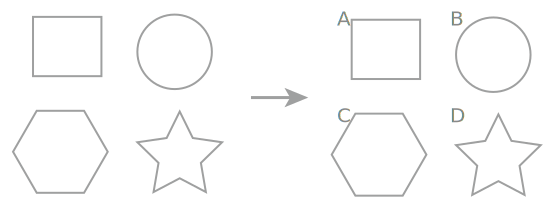

# Illustrator Panel Labeler

**[English](README.md) README**

一个用于 Adobe Illustrator 的自动化脚本，可以自动对齐选中的对象并添加字母标签（A, B, C, D...）。




## 功能特性

- **智能对齐**：自动识别对象的行列关系，并对齐到网格
  - 先对齐列（水平方向）：同一列的对象对齐到最左侧
  - 再对齐行（垂直方向）：同一行的对象对齐到最顶部
- **自动标记**：按照从上到下、从左到右的顺序，自动添加字母标签（A, B, C, D...）
- **灵活控制**：可以分别控制对齐和标记功能，支持分步执行
- **智能分组**：基于对象中心点自动识别行列关系

## 安装方法

1. 打开 Adobe Illustrator
2. 将 `illustrator-panel-labeler.jsx` 文件复制到以下目录之一：
   - **Windows**: `C:\Program Files\Adobe\Adobe Illustrator [版本]\Presets\[语言]\Scripts\`
   - **macOS**: `/Applications/Adobe Illustrator [版本]/Presets/[语言]/Scripts/`
3. 重启 Illustrator（或运行 `文件 > 脚本 > 其他脚本...` 直接选择文件）

## 使用方法

### 基本使用

1. 在 Illustrator 中打开或创建一个文档
2. 选择需要对齐和标记的对象（可以是多个对象或组）
3. 运行脚本：
   - **方法一**：`文件 > 脚本 > illustrator-panel-labeler`
   - **方法二**：`文件 > 脚本 > 其他脚本...`，然后选择 `illustrator-panel-labeler.jsx`
4. 脚本会自动执行对齐和标记操作

### 分步执行

如果需要分步执行（先对齐，检查效果，再添加标签），可以修改脚本中的控制变量：

```javascript
// Step control: set to true to align objects, false to skip alignment
var doAlign = true;   // 设置为 false 可跳过对齐步骤
// Step control: set to true to add labels, false to skip labeling
var doLabel = true;   // 设置为 false 可跳过标记步骤
```

**示例工作流程**：
1. 第一次运行：设置 `doAlign = true; doLabel = false;` - 只执行对齐
2. 检查对齐效果
3. 第二次运行：设置 `doAlign = false; doLabel = true;` - 只添加标签

## 配置选项

在脚本的 `settings` 部分可以自定义以下参数：

```javascript
// ===== settings =====
var fontSize = 20;     // 标签字体大小（单位：pt）
var dx = 1;            // 标签水平偏移量（单位：pt，正值向右）
var dy = 1;            // 标签垂直偏移量（单位：pt，正值向下）
var startCharCode = "A".charCodeAt(0);  // 起始字母（A, B, C...）
```

### 参数说明

- **fontSize**：标签文字的字体大小，默认 20pt
- **dx**：标签相对于对象左上角的水平偏移量，默认 1pt（向右）
- **dy**：标签相对于对象左上角的垂直偏移量，默认 1pt（向下）
- **startCharCode**：标签的起始字母，默认为 "A"

> **提示**：如果标签位置方向不对，可以调整 `dx` 和 `dy` 的值。例如，如果标签应该在对象下方，可以将 `dy` 改为正值。

## 工作原理

### 对齐算法

1. **收集对象信息**：读取所有选中对象的几何边界（位置、大小、中心点）
2. **分组识别**：
   - **行分组**：基于对象的中心 Y 坐标，如果两个对象的中心 Y 距离 ≤ 较小对象高度的一半，则视为同一行
   - **列分组**：基于对象的中心 X 坐标，如果两个对象的中心 X 距离 ≤ 较小对象宽度的一半，则视为同一列
3. **执行对齐**：
   - 先对齐列：同一列的所有对象对齐到该列最左侧对象的左边缘
   - 再对齐行：同一行的所有对象对齐到该行最顶部对象的上边缘

### 标记算法

1. **排序**：按照从上到下、从左到右的顺序排序对象
   - 首先按 top 值从大到小排序（top 值越大，在屏幕上越靠上）
   - 如果 top 值相近（容差内），则按 left 值从小到大排序
2. **分组**：将 top 值相近的对象归为同一行
3. **标记**：按顺序为每个对象添加字母标签（A, B, C, D...）

## 注意事项

1. **对象选择**：确保在运行脚本前已选中需要处理的对象
2. **对象类型**：脚本支持各种对象类型（路径、组、复合路径等）
3. **锁定对象**：被锁定的对象无法被移动，请确保对象未被锁定
4. **字体要求**：脚本会自动查找 Arial 字体，如果系统中没有 Arial，会使用第一个包含 "Arial" 的字体
5. **坐标系统**：Illustrator 使用向下为 Y 轴正方向的坐标系统，脚本已正确处理

## 常见问题

### Q: 对象没有对齐？

A: 检查以下几点：
- 确保对象未被锁定
- 检查对象是否被正确分组（同一行/列的对象中心点距离是否在容差范围内）
- 尝试先只执行对齐步骤（`doAlign = true; doLabel = false;`）检查效果

### Q: 标签顺序不对？

A: 标签顺序基于对象的 top 和 left 值。如果顺序不对，可能是：
- 对象位置识别有误
- 可以尝试先对齐对象，再添加标签

### Q: 标签位置不对？

A: 调整脚本中的 `dx` 和 `dy` 参数：
- `dx` 控制水平位置（正值向右，负值向左）
- `dy` 控制垂直位置（正值向下，负值向上）

### Q: 如何更改标签起始字母？

A: 修改 `startCharCode` 参数：
```javascript
var startCharCode = "A".charCodeAt(0);  // 从 A 开始
// 或
var startCharCode = "1".charCodeAt(0);  // 从数字 1 开始（需要调整后续逻辑）
```

## 许可证

请查看 [LICENSE](LICENSE) 文件了解许可证信息。

## 贡献

欢迎提交 Issue 和 Pull Request！
